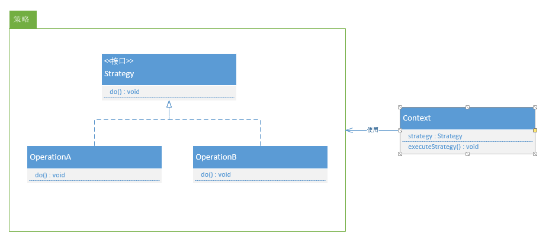
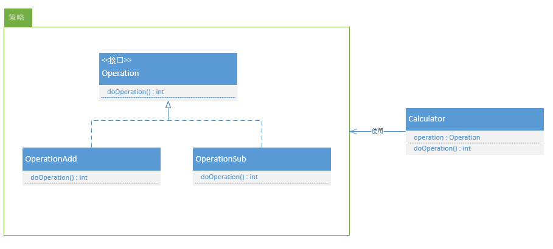
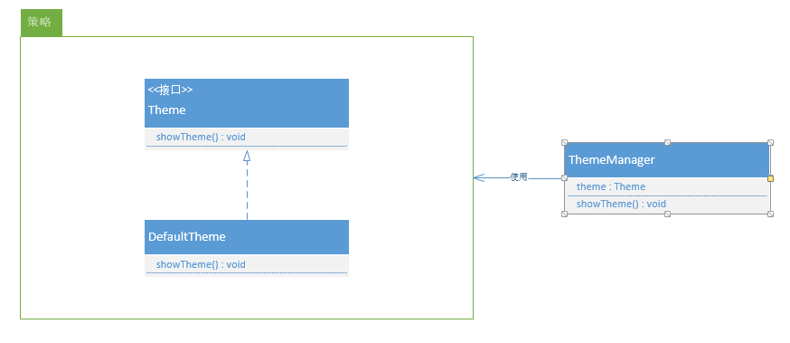

# 策略模式
## 概述
策略模式定义了算法族，分别封装起来，让他们之间可以互相替换，此模式让算法的变化独立于使用算法的客户。

一般情况下我们是将一种行为写成一个类方法，比如计算器类中有加、减、乘、除四种方法，而策略模式则是将每一种算法都写成一个类，然后动态地选择使用哪一个算法。

这里所说的算法并不是指 “ 冒泡排序算法 ” 、“ 搜索算法 ” 之类的算法，它可以是一段代码、一个请求、一个业务操作。

策略模式如图：


从上图可以看到，我们将操作封装到类中，他们实现了同一个接口，然后在 Context 中调用。

这里我们举一个计算器的例子：



此例中，为加法和减法分别创建了一个类。

其实策略不一定要命名为 Strategy ，Context 不一定要叫 Context ，可以根据实际情况自己命名，在计算器的例子中，你如果非要命名为 Strategy 和 Context ，反而让人产生疑惑。

实际代码也很简单，具体如下。

Operation 接口：
```
public interface Operation {
    public int doOperation(int num1, int num2);
}
```
两个实现类 —— 加法和减法：
```
public class OperationAdd implements Operation{
    @Override
    public int doOperation(int num1, int num2) {
        return num1 + num2;
    }
}

public class OperationSub implements Operation {
    @Override
    public int doOperation(int num1, int num2) {
        return num1 - num2;
    }
}
```
计算器类：
```
public class Calculator {
    private Operation operation;

    public void setOperation(Operation operation){
        this.operation = operation;
    }

    public int doOperation(int num1, int num2){
        return this.operation.doOperation(num1,num2);
    }
}
```
使用：
```
Calculator calculator = new Calculator();
calculator.setOperation(new OperationAdd());
int result = calculator.doOperation(1,2);
System.out.println(result);
```
使用计算器类时，如果要进行加法运算，就 New 一个加法类传入，减法也是同理。

看到这里，相信大家一定会有疑惑，为什么要把加、减、乘、除四则运算分别封装到类中？直接在 Calculator 中写 add() 、sub() 等方法不是更方便吗？甚至如果要添加其他的运算方法，每次都要创建一个类，反而更麻烦。

的确，用了策略模式之后代码比普通写法多了一些，但是这里假设一种场景：把写好的计算器代码打包好作为一个库发布出去给其他人用，其他人发现你的计算器中只有加、减、乘、除四个方法，而他想增加平方、开方等功能，怎么办？

如果是用普通写法写的计算器，想要增加功能唯一的办法就是修改你写好的 Calculator ，增加平方和开方两个 method 。

可是你提供的是一个 jar 包啊，jar 包，jar…jar…jar…jar…包……

就算你提供的是源码，你希望其他人可以随意修改你写好的代码吗？一般我们发布出去的开源框架或库都是经过千锤百炼、经过测试的代码，其他人随意修改我们的源码很容易产生不可预知的错误。

如果你用的是策略模式，那么其他人想要增加平方或开平方功能，只需要自己定义一个类实现你的 Operation 接口，然后调用 calculator.setOperation(new 平方类()); 即可。

看到这里相信你已经对策略模式有了一定的好感，甚至惊叹一声：哇，还有这种操作？

顺便提一嘴，这里很好的体现了一个设计模式的基本原则：开闭原则。开闭原则说的是 ” 对修改关闭、对扩展开放 “ 。对修改关闭就是不希望别人修改我们的代码，此路不通，对扩展开放就是希望别人以扩展的方式增加功能，策略模式把开闭原则体现得淋漓尽致。

## 实际案例
### 1.主题
隔壁老王准备开发一个客户端框架，允许其他的开发者进行二次开发，其中有一个更换主题的功能，开发者们可以自己定义主题。老王很快就想到了策略模式，并且提供了一个默认主题 DefaultTheme ：



代码：
```
public interface Theme {
    public void showTheme();
}

public class DefaultTheme implements Theme {
    @Override
    public void showTheme() {
        //此处设置主题颜色，背景，字体等
        System.out.println("显示默认主题");
    }
}
public class ThemeManager {

    private Theme theme;

    public void setTheme(Theme theme){
        this.theme = theme;
    }

    public void showTheme(){
        this.theme.showTheme();
    }
}
```

使用：
```
ThemeManager themeManager = new ThemeManager();
themeManager.setTheme(new DefaultTheme());
themeManager.showTheme();
```
看完更换主题的案例代码，你会发现跟计算器惊人地相似，没错，所谓设计模式就是前人总结出来的武功套路，经常可以直接套用。当然也要灵活地根据实际情况进行修改，设计模式想要传达给我们的更多的是一种编程思想。

这里还有一个小窍门：
```
themeManager.setTheme(new DefaultTheme());
```
在这里老王 New 一个默认主题对象，如果其他开发者加了主题，还要修改这行代码，New 开发者自定义的主题对象。根据开闭原则，我们不希望其他人修改我们的任何一行代码，否则拔刀相见。老王机智地将主题的包名和类名写到了配置文件中，利用 Java 的反射机制动态生成主题对象，因此更换主题也只要修改配置文件即可。

### 2.Shiro
Shiro 是 Java 界最著名的权限控制框架之一，相信大家都不陌生。在 Shiro 中，我们可以创建多个权限验证器进行权限验证，如验证器 A、验证器 B、验证器 C，三个验证器可以同时生效。

那么就产生了一个问题，如果验证器 A 验证通过，B 验证不通过，C 验证通过，这种情况怎么办？到底算当前用户验证通过还是不通过呢？

Shiro 给我们提供了三种验证策略，就像老王默认提供了一种主题一样：

* AtLeastOneSuccessfulStrategy ：只要有一个验证通过，那么最终验证结果就是通过。
* FirstSuccessfulStrategy ：只有第一个成功地验证的 Realm 返回的信息将被使用，所有进一步的 Realm 将被忽略，如果没有一个验证成功，则整体尝试失败。
* AllSucessfulStrategy ：所有验证器都必须验证成功。
如果你不熟悉 Shiro ，看不懂上面三种策略的含义，没关系，本专栏内容讲的是设计模式，而不是 Shiro 的使用，你只要知道 Shiro 默认为我们提供了三种策略即可。

作为开发者，在使用 Shiro 的时候，Shiro 默认的策略未必符合我们的需求，比如我们要求三个验证器中通过两个才算通过，怎么办？很简单，Shiro 这里用的也是策略模式，我们只要自定义一个 MyAuthenticationStrategy 继承 Shiro 的 AbstractAuthenticationStrategy 。咦？前面不是说实现接口吗，这里怎么是继承？变通，要懂得变通。设计模式不是一成不变的，重要的是这种编程思想。

然后在 MyAuthenticationStrategy 实现父类要求的方法，再修改配置文件将当前验证策略改为你定义的验证策略：
```
authcStrategy = 你的包名.MyAuthenticationStrategy
```

## 总结
1. 优点
讲完上面的例子，优点已经十分明显了，那就是遵循了开闭原则，扩展性良好。

2. 缺点
   * 随着你的策略增加，你的类也会越来越多。
   * 所有的策略类都要暴露出去，所以如果你在实际开发中使用了策略模式，一定要记得写好文档让你的伙伴们知道已有哪些策略。就像 Shiro 默认提供了三种验证策略，就必须在文档中写清楚，否则我们根本不知道如何使用。

当然，权衡利弊，跟优点比起来，这些缺点都不算事儿。